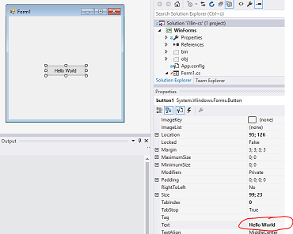

# i18n-cs
This is a collection of Visual Studio 2015 Applications to demonstrate internationalization in C# Code, WinForms, WPF and WIX installers.

## WinForms
This Tutorial is based on Microsofts MSDN Tutorial [Walkthrough: Localizing Windows Forms](https://msdn.microsoft.com/en-us/library/y99d1cd3(v=vs.100).aspx)

Following resources are used for internationalzation:

* Project resources (non-form-based, dialog-boxes, error-messages)
* Form resources (Auto-generated)

**Hint:** For Forms-Property: always use either project OR form resources, not mixed

1. Set project as localizable

	

2. Open Form to translate

3. Change Property Language of Form to English

	**Hint:** Always use _English_ and not a specific English locale such as _English (United States)_

4. Set Text of desired Element (e.g. Button) to translated to new Text.

## Code

Use the following code to access the resource:

	MyNamespace.Properties.Resources.My_Zip_File;
	
## WPF