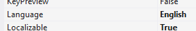
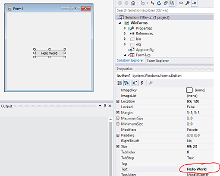
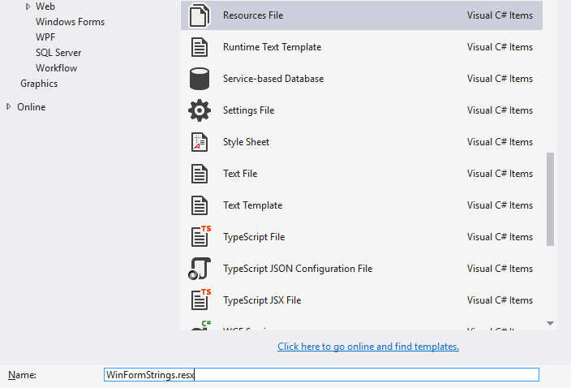

# i18n-cs
This is a collection of Visual Studio 2015 Applications to demonstrate internationalization in C# Code, WinForms, WPF and WIX installers.
The default language is Japanese and translations to English will be added.

## WinForms
This Tutorial is based on Microsofts MSDN Tutorial [Walkthrough: Localizing Windows Forms](https://msdn.microsoft.com/en-us/library/y99d1cd3(v=vs.100).aspx)

Following resources are used for internationalzation:

* Project resources (non-form-based, dialog-boxes, error-messages)
* Form resources (Auto-generated)

**Hint:** For Forms-Property: always use either project OR form resources, not mixed

### Localizable Forms (Form resources)

1. Set project as localizable

	

2. Open Form to translate

	

3. Change Property Language of Form to English

	**Hint:** Always use _English_ and not a specific English locale such as _English (United States)_

	

4. Set Text of desired Element (e.g. Button) to translated to new Text.

	

### Localizable Error-message and dialog-boxes (Project resources)

This part is also applicable to simple Console-applications

1. Add new Resource-file to the Project

	**Hint:** This file is the fallback for the current default language (Japanese), so the text in this file should be Japanese.

	
	
2. Enter a new string with a default Japanese text.

	

3. Repeat step 1 and 2 with a new file named _WinFormStrings.en.resx_

	

4. To access the manually added resources (e.g. on a button-click) use the following code:

		using System.Resources;
		
		...
		
		// Declare a Resource Manager instance. (Include namespace if set)
        ResourceManager LocRM = new ResourceManager("WinForms.WinFormStrings", typeof(Form1).Assembly);
        // Assign the string for the "errorInsuffMemory" key to a message box.
        MessageBox.Show(LocRM.GetString("errorInsuffMemory"));

**Hint:** To force the program to start in a specific locale, uncomment one of these lines in _Program.cs_ 

	//Thread.CurrentThread.CurrentUICulture = new CultureInfo("ja-JP"); //Japanese (Default of this project)
    //Thread.CurrentThread.CurrentUICulture = new CultureInfo("en-GB"); //English	
	
## Code
See WinForms -> Localizable Error-message and dialog-boxes (Project resources)
	
## WPF