# i18n-cs
This is a collection of Visual Studio 2015 Applications to demonstrate internationalization in C# Code, WinForms, WPF and WIX installers.
The default language is English and translations to Japanese are added. This approach is recommended so systems other than Japanese or English will see an English interface.

# C-Sharp

## C# Application's default culture
To define the application's default culture (In this case English), the _NeutralResourcesLanguageAttribute_ AssemblyInfo must be set:

**Hint:** Always use _English_ and not a specific English locale such as _English (United States)_

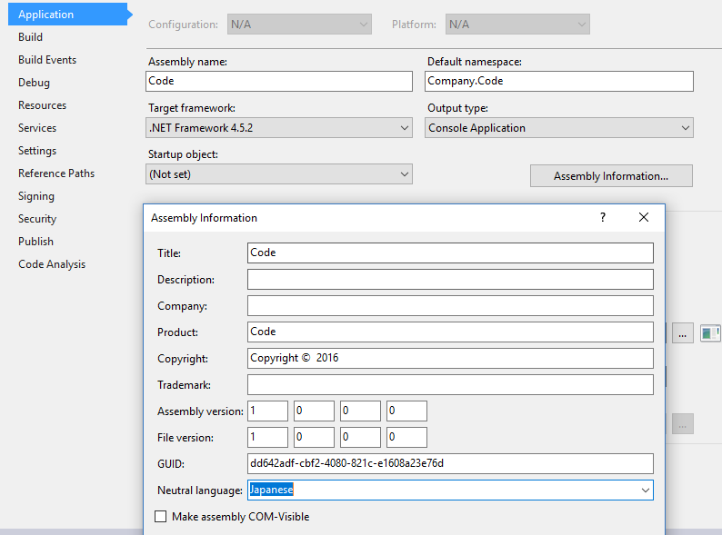

## C# WinForms

*Example Project: WinForms*

This Tutorial is based on Microsofts MSDN Tutorial [Walkthrough: Localizing Windows Forms](https://msdn.microsoft.com/en-us/library/y99d1cd3(v=vs.100).aspx)

Following resources are used for internationalzation:

* Project resources (non-form-based, dialog-boxes, error-messages)
* Form resources (Auto-generated)

**Hint:** For Forms-Property: always use either project OR form resources, not mixed

### Localizable Forms (Form resources)

1. Set project as localizable

	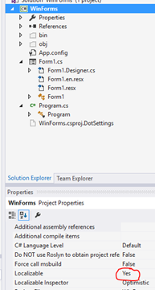

2. Open Form to translate

	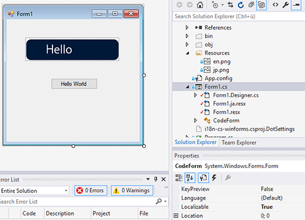

3. Change Property Language of Form to Japanese

	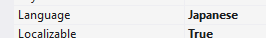

4. Set Text of desired Element (e.g. Button) to translated new Text.

	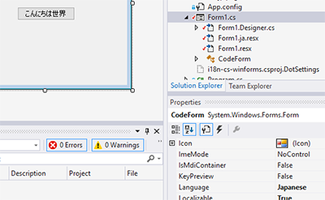

### Localizable Error-message and dialog-boxes (Project resources)

This part is also applicable to simple Console-applications

1. Add new Resource-file to the Project

	**Hint:** This file is the fallback for the current default language (English), so the text in this file should be English.

	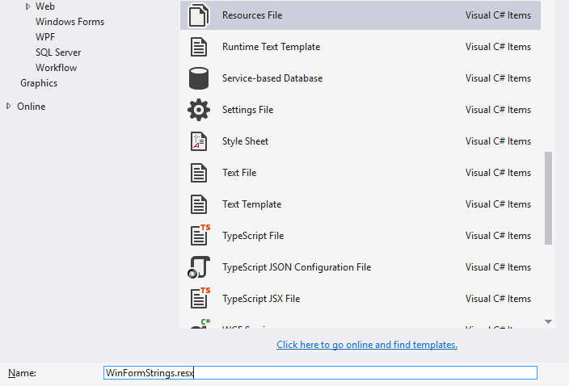
	
2. Enter a new string with a default English text.

	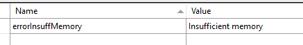

3. Repeat step 1 and 2 with a new file named _WinFormStrings.ja.resx_

	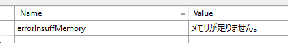

4. To access the manually added resources (e.g. on a button-click) use the following code:

		using System.Resources;
		
		...
		
		// Access resource by Getter (Recommended as by http://stackoverflow.com/a/14503044/2003325)
		MessageBox.Show(WinFormStrings.errorInsuffMemory);

**Hint:** To force the program to start in a specific locale, uncomment one of these lines in _Program.cs_ 

	//Thread.CurrentThread.CurrentUICulture = new CultureInfo("ja-JP"); //Japanese
    //Thread.CurrentThread.CurrentUICulture = new CultureInfo("en-GB"); //English (Default of this project)
	
**Hint:** Instead of creating a new default resources-file the existing default Resources.resx file under Properties may be used. (See [this stackoverflow answer](http://stackoverflow.com/a/1129152/2003325)).
For this, only a new Resources file for the additional language Japanese must be added: _Resources.ja.resx_.
However, this approach results that ALL strings will be in one file and can't be distinguished. So separated Resources-files are strongly recommended!
	
## C# Code

*Example Project: CodeDefaultEnglish*

See WinForms -> Localizable Error-message and dialog-boxes (Project resources)

## C# Fallback to Satellite Assembly
Usually the application fallback is the main assembly if the requested UI Culture cannot be found. 
However, if another culture should be used as a fallback, you may do so by defining a satellite assembly for fallback:

See [Packaging and Deploying Resources in Desktop Apps](https://msdn.microsoft.com/en-us/library/sb6a8618(v=vs.110).aspx) -> Ultimate Fallback to Satellite Assembly

Set in Code or in AssemblyInfo.cs

	[assembly:NeutralResourcesLanguage("en", UltimateResourceFallbackLocation.Satellite)]
	
There are various combinations of default language and satellite languages (The specfic VS-Project in bold):

* **CodeDefaultEnglish** - Default language is English, Satellite Japanese -> Fallback will be English (e.g. German user) **Recommended**
* **CodeDefaultJapanese** - Default language is Japanese, Satellite English -> Fallback will be Japanese (e.g. German user)
* **CodeJapaneseDefaultSatelliteEn** - Default language is Japanese, Satellite English AND Japanese -> Ultimate Fallback on English -> Fallback will be English

## C# WPF

*Example Project: WPF*

This Tutorial is NOT based on Microsofts MSDN Tutorial [WPF Globalization and Localization Overview](https://msdn.microsoft.com/en-us/library/ms788718(v=vs.110).aspx)

Instead we will use the free WPFLocalizationExtension (https://github.com/SeriousM/WPFLocalizationExtension) under the [Ms-PL license](https://tldrlegal.com/license/microsoft-public-license-(ms-pl)) in combinatino with Resources .resx files.

Follow the very simple Tutorial [WPF: Localization using Resources and Localization Extension](http://www.broculos.net/2014/04/wpf-localization-using-resources-and.html#.WBlSQvqLSUk) and mind the hints below:

* You can install the WPFLocalizationExtension using NuGet:

		Install-Package WpfLocalizeExtension

* For created Resource .resx files, set the Access Modifier to _Public_

* Specify the current language to the System langauge in starting your application:

		LocalizeDictionary.Instance.SetCurrentThreadCulture = true;
		
		//Set Extension Culture to System culture:
		LocalizeDictionary.Instance.Culture = new CultureInfo(CultureInfo.CurrentUICulture.Name);
		
* How to prepare your XAML, you may see here [Usage - Preparing the XAML code](https://wpflocalizeextension.codeplex.com/wikipage?title=Preparing%20the%20XAML%20code&referringTitle=Documentation)

		<Window xmlns:lex="http://wpflocalizeextension.codeplex.com"
			lex:LocalizeDictionary.DesignCulture="en"
			lex:ResxLocalizationProvider.DefaultAssembly="WPF"
			lex:ResxLocalizationProvider.DefaultDictionary="LocResources">
			<!-- Some controls -->
		</Window>
		
* How to access the resoruces in the XAML you may find here: [Usage - Keys](https://wpflocalizeextension.codeplex.com/wikipage?title=Keys&referringTitle=Documentation)

* If you would like to access Resources from different Assemblies in the XAML, look here: [Usage - Multiple assemblies and dictionaries](https://wpflocalizeextension.codeplex.com/wikipage?title=Multiple%20assemblies%20and%20dictionaries)
	
* Look at the [WPFLocalizationExtension Wiki](https://wpflocalizeextension.codeplex.com/documentation) for further questions

### Additional helpful features

* SizeToContent - Make window size automatic depending on content

		<Window SizeToContent="WidthAndHeight">

* SharedSizeGroup - The elements have the same size from the biggest element

		<Grid.ColumnDefinitions>
		  <ColumnDefinition x:Uid="ColumnDefinition_1" />
		  <ColumnDefinition x:Uid="ColumnDefinition_2" />
		  <ColumnDefinition x:Uid="ColumnDefinition_3" **SharedSizeGroup="Buttons"** />
		  <ColumnDefinition x:Uid="ColumnDefinition_4" **SharedSizeGroup="Buttons"** />
		  <ColumnDefinition x:Uid="ColumnDefinition_5" **SharedSizeGroup="Buttons"** />
		</Grid.ColumnDefinitions>

	
## C# Translate resource files
Potentially useful tool for translating resource files:

Zeta Resource Editor (https://www.zeta-resource-editor.com/index.html)

## C# Tree-View of resource-files with language
How to get a treeview of culture-specific resources

Unload the project
Edit the corresponding csproj file
Locate the tags of the resources and rewrite them using the DependentUpon syntax:

	<EmbeddedResource Include="Strings.de.resx">
	  <SubType>Designer</SubType>
	  <DependentUpon>Strings.resx</DependentUpon>
	</EmbeddedResource>
	<EmbeddedResource Include="Strings.resx">
	  <Generator>ResXFileCodeGenerator</Generator>
	  <LastGenOutput>Strings.Designer.cs</LastGenOutput>
	</EmbeddedResource>
	
# Visual C++

*Example Project: Cpp*

Basic for localization in Visual C++ are resources in .dll or .exe [Implementing Globalization / Multilingual feature in win32 API application](http://stackoverflow.com/a/1654791/2003325)

Each resource contains a language identifier. The same resource with the same name may exist with different languages.
To access these resources the Windows SDK LoadString, LoadBitmap etc. may be used.
	
Strings in your code should be in a _String Table resource_ and retrieved using LoadString (or more neutrally FindResource).

1. Create resource and add String Tables for both languages English and Japanese

	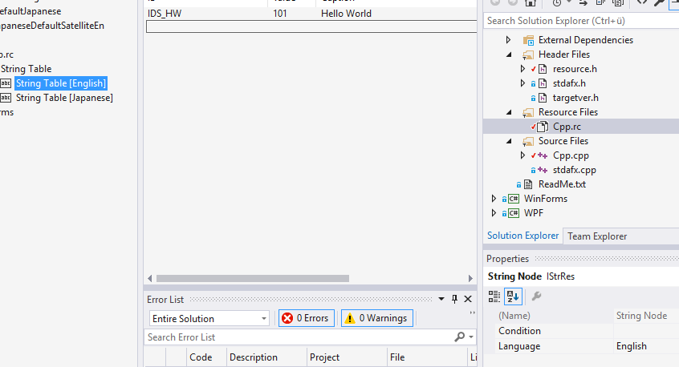
	
	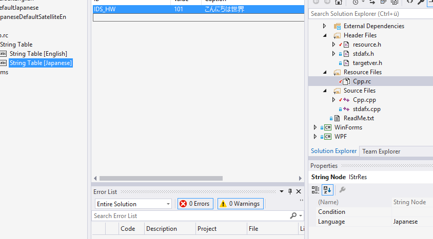

2. Create the following wrapper function using _LoadString_ for loading a string from a resource (Source: [Stackoverflow post: c++, Win32 LoadString wrapper](http://stackoverflow.com/a/33336980/2003325)):

		std::wstring LoadStringW(unsigned int id)
		{
			const wchar_t* p = nullptr;
			int len = ::LoadStringW(nullptr, id, reinterpret_cast<LPWSTR>(&p), 0);
			if (len > 0)
			{
				return std::wstring(p, static_cast<size_t>(len));
			}
			// Return empty string; optionally replace with throwing an exception.
			return std::wstring();
		}

3. Enable your application to support Unicode output in console as well as in stdout, use the _wmain_ signature and set the following lines at the beginning of your application:

		int wmain(int argc, wchar_t* argv[])
		{
			_setmode(_fileno(stdout), _O_U16TEXT); //_O_WTEXT
			//stdout may now be written to file (First character must be ASCII if output is written to file)
			std::wcout << L"Enabling Unicode support" << std::endl;
			...
		}
	
4. Load and output your string:

		//Load multi-lang resource
		std::wstring str = LoadStringW(IDS_HW);

		//Output using wprintf
		wprintf(str.c_str());
		std::wcout << std::endl;

		//Output using wcout
		std::wcout << str << std::endl;
		
* **Hint:** Following includes are required:

		#include "stdafx.h"
		#include "resource.h" //Enables us to load our resources -> multi-lang strings
		#include <string>
		#include <iostream>
		#include <io.h> //for setting outputmode UNICODE
		#include <fcntl.h> //contains _O_U16TEXT

# Python (IronPython 2.7)

*Example project: IronPythonPackageLib and IronPythonCsharp*

This tutorial is based on [IronPython Python 2.7 - Internationalizing your programs and modules](https://ironpython-test.readthedocs.io/en/latest/library/gettext.html#internationalizing-your-programs-and-modules)

Tutorial for translation using Poedit (Warning Python 3!): [Translate Your Python 3 Program with the gettext Module](http://inventwithpython.com/blog/2014/12/20/translate-your-python-3-program-with-the-gettext-module/)
[Unicode mess](http://www.wefearchange.org/2012/06/the-right-way-to-internationalize-your.html)

[A complete guide to i18n in Python](http://www.mattlayman.com/2015/i18n.html) with [Github example: handroll](https://github.com/handroll/handroll)

##Python-part
First we start with the Python-Part. In the example project _IronPythonPackageLib_ there are two packages for demonstration: **sample** and **package**.

**Given state:** The _core_-module in the **sample**-package calls a function in the _side_-module of the **package**-package. All the strings are given in the source-code.

**Desired state:** Translations per package

Following steps have been taken in the example-project to achieve this translation:

1. Mark all strings which you'd like to translate with 

		_('...Text...')
		
	For formatted strings:
	
	**Hint:** For translated strings: use keys or at least indexes for translaters to change position of replaced strings!
	
		numb1 = 1
		numb2 = 2
		#Former format string: print('This is a formatted string: %2d %d' % (numb1, numb2))
		print(_('This is a formatted string: {n1:2d} {n2:d}').format(n1=numb1, n2=numb2))
		print(_('This is a formatted string: {0:2d} {1:d}').format(numb1, numb2))
		print(_('This is a formatted string: %(n1)2d %(n2)d') % {'n1':numb1, 'n2':numb2})
	
2. Run _pygettext.py_ (Similar to GNU xgettext) from _C:\Python27\Tools\i18n_ on your IronPython-packages containing your .py-files
	
	**Hint:** IronPython does not contain a Tools\i18n folder! Use the one from a regular Python 2.7 instance instead (in the example _IronPythonPackageLib_ already contains a copy of _pygettext.py_ for convenience)

		pygettext.py -d sample sample/*.py
		pygettext.py -d package package/*.py
		
	This will get you a _sample.pot_ and _package.pot_ template file containing all the marked strings per package.
	
3. Move the generated _sample.pot_ template file to IronPythonPackageLib/locale/sample.pot

4. Copy it and save it to _IronPythonPackageLib/locale/ja/LC_MESSAGES/sample.po_ (Yes _.po_, not _.pot_ - make sure the file is saved in Unicode). Now you may open it and translate the strings: msgid is the original string, msgstr is the translation. Don't forget to set "Language: ja\n"

	**Hint:** You may use the Tool [Poedit](https://poedit.net/) to translate your strings:
	
	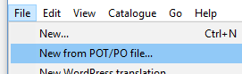
	
	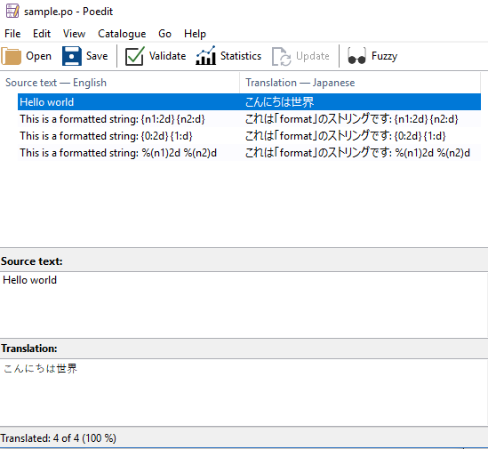

5. Convert the .po-file to a .mo-binary-file using _msgfmt.py_ in _C:\Python27\Tools\i18n_

	**Hint:** If you've used Poedit, the tool has already done this for you :)

		msgfmt.py sample
		
6. Repeat steps 3-5 for _package.pot_
		
7. To localize per package (Domain per Package) we'll introduce the _()-function per package-namespace.	Add the following code in the _\_init_\__.py-file of the **sample**-packge:
	
		current_locale, encoding = locale.getdefaultlocale()
		_ = gettext.translation('sample', 'locale', [current_locale], fallback = True).ugettext #unicode gettext
		
8. Do the same for the \_\_init__.py-file of the **package**-packge (Write package instead of sample)

9. Python-part finished!

10. **Addition maintenance:** If you're source file has changd and you need to add the new translations, just edit the .po and add the new strings

	**OR:** Even easier is the process with Poedit: 
	* Generate the new .pot file as usual
	* Open your existing .po-translation with Poedit and select _Catalogue -> Update from POT-file_
	* Select the new generated .pot file
	* All new strings have been added to your existing translation
	* Translate the new strings to Japanese

**Hint:** For all files containing UTF-8 characters, put this at top of file:
	
	# -*- coding: utf-8 -*-

**Addition:** If you'd like to change languages on the fly use this snippet (Only as an info, not in example, see: [Changing languages on the fly](https://ironpython-test.readthedocs.io/en/latest/library/gettext.html#changing-languages-on-the-fly)):

		import gettext

		langEn = gettext.translation('IronPython', languages=['en'])
		langJa = gettext.translation('IronPython', languages=['ja'])

		# start by using language1
		langEn.install()
		

	
##C#-part	
The C#-part is not described in this tutorial, see the _IronPythonCsharp_-Project for how to execute the IronPython-Assembly from C#.

##Python to C-Sharp
The _make_python_dll.bat_-Script in _IronPythonPackageLib/tool_ is used to perform the following tasks:

1. Package the standard python libraries to an assembly (stdipy.dll **and _stdipyencod.dll_**)
2. Package the custom python packages **sample** and **package** to _sample.dll_ and _package.dll_
3. Add custom resource informations to the dlls using ResHacker.exe
4. Copy all the assemblies and **the _locale_-folder** to _IronPythonCsharp/bin/Release_
	
You may start the application using _IronPythonCsharp/bin/Release/IronPythonCsharp.exe_

##FAQ:

* Why are not keys used in msgid? 

	See [Combining keys and full text when working with gettext and .po files](http://stackoverflow.com/a/15758551/2003325)

* What options do we have to get different translations per package? 

	See [How do I use multiple .mo files simultaneously for gettext translation?](http://stackoverflow.com/a/34768780/2003325)

* Why should we use keywords for formatting instead of % or {}? 

	The order of the inserted strings may change depending on language, See: ["You have a {color} {car}" and "Vous avez une {car} {color}"](http://inventwithpython.com/blog/2014/12/20/translate-your-python-3-program-with-the-gettext-module/#comment-205535)
	How to use _%_ and _.format()_ See: [PyFormat](https://pyformat.info/)
	
# WiX Toolset v3.10.3 (.msi installer)

*Example project: CodeSample-Msi which installs the IronPythonCsharp project*

The following official and very good WIX Tutorial is used: [How To: Make your installer localizable](http://wixtoolset.org/documentation/manual/v3/howtos/ui_and_localization/make_installer_localizable.html)

**Hint:** This Tutorial requires an already existing WiX-Installer (Windows Installer XML)-project in your solution

For information about the use of different codepages per languaeg, see: [WiX - Code Pages](http://wixtoolset.org/documentation/manual/v3/overview/codepage.html)

**Important:** For English you must use _WixLocalization Culture="en-us"_ and not "en"! Else, all WixUI-element translations must be provided by yourself.

##FAQ

* What are the Codepages and Languages?

	* Japanese (ja-jp) Language: 1041 Codepage: 932, 
	* English United States (en-us) Language: 1033 Codepage: 0 (only ASCII)
	
	**Important:** Actually the Codepage of English United States is 1252, however to have a general Codepage for all systems, we select 0 which only allows ASCII-characters (128)

* The msi-installer won't start on a Japanese system with the error "変換するときにエラーが発生しました。指定された変換のパスが有効であることを確認してください。", what to do?

	Look here: [single msi-file seems to need 1033.mst transform file](http://windows-installer-xml-wix-toolset.687559.n2.nabble.com/single-msi-file-seems-to-need-1033-mst-transform-file-td3261535.html)

	Important is, that the Package-Languages attribute must only contain the desired language and must be overriden by the WixLocalization-element:
	
		<Package Languages="!(loc.ProductPackageLanguage)" .../>
		
	and in english.wxl:
	
		<String Id="ProductPackageLanguage" Localizable="no">1033</String>
		
	and in japanese.wxl:
	
		<String Id="ProductPackageLanguage" Localizable="no">1041</String>
		
* I've used the English installer, but the application is in Japanese, why?

	In this case, you are running a Japanese system. The application uses your UILanguage and not the Installer-Language